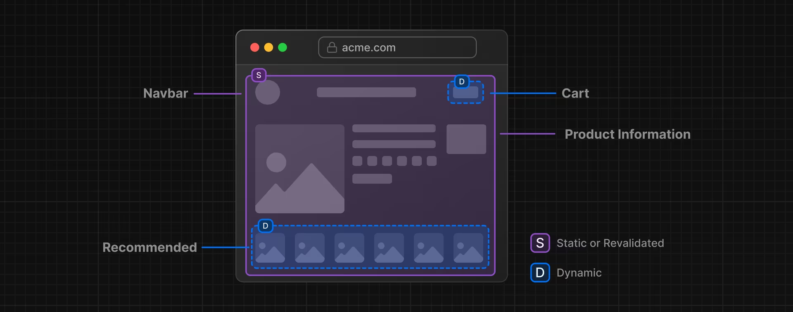

# Bab 10

## Partial Prerendering
Sejauh ini, Anda telah mempelajari tentang rendering statis dan dinamis, serta bagaimana melakukan streaming konten dinamis yang bergantung pada data. Dalam bab ini, mari kita pelajari cara menggabungkan rendering statis, rendering dinamis, dan streaming dalam rute yang sama dengan Partial Prerendering (PPR).

Partial Prerendering adalah fitur eksperimental yang diperkenalkan di Next.js 14. Konten halaman ini dapat diperbarui seiring dengan perkembangan stabilitas fitur ini.

### Dalam bab ini...
Berikut adalah topik yang akan kita bahas:
- Apa itu Partial Prerendering.
- Bagaimana Partial Prerendering bekerja.

### Rute Statis vs. Dinamis
Untuk sebagian besar aplikasi web yang dibangun hari ini, Anda memilih antara rendering statis dan dinamis untuk seluruh aplikasi atau untuk rute tertentu. Di Next.js, jika Anda memanggil fungsi dinamis dalam suatu rute (seperti mengkueri database Anda), seluruh rute menjadi dinamis.

Namun, sebagian besar rute tidak sepenuhnya statis atau dinamis. Misalnya, pertimbangkan situs e-commerce. Anda mungkin ingin merender sebagian besar halaman informasi produk secara statis, tetapi Anda mungkin ingin mengambil keranjang pengguna dan produk yang direkomendasikan secara dinamis, ini memungkinkan Anda menampilkan konten yang dipersonalisasi kepada pengguna Anda.

Kembali ke halaman dashboard Anda, komponen mana yang Anda anggap statis vs. dinamis?

Setelah Anda siap, klik tombol di bawah ini untuk melihat bagaimana kami akan membagi rute dashboard:

### Apa itu Partial Prerendering?
Next.js 14 memperkenalkan versi eksperimental Partial Prerendering – model rendering baru yang memungkinkan Anda menggabungkan manfaat dari rendering statis dan dinamis dalam rute yang sama. Sebagai contoh:



Saat pengguna mengunjungi rute:
- Shell rute statis yang mencakup navbar dan informasi produk disajikan, memastikan pemuatan awal yang cepat.
- Shell meninggalkan lubang di mana konten dinamis seperti keranjang dan produk yang direkomendasikan akan dimuat secara asinkron.
- Lubang asinkron dialirkan secara paralel, mengurangi waktu muat keseluruhan halaman.

### Bagaimana Partial Prerendering Bekerja?
Partial Prerendering menggunakan Suspense React (yang Anda pelajari di bab sebelumnya) untuk menunda rendering bagian dari aplikasi Anda sampai beberapa kondisi terpenuhi (misalnya data dimuat).

Fallback Suspense disematkan ke dalam file HTML awal bersama dengan konten statis. Pada saat build (atau selama revalidasi), konten statis dirender sebelumnya untuk membuat shell statis. Rendering konten dinamis ditunda sampai pengguna meminta rute.

Membungkus komponen dalam Suspense tidak membuat komponen itu sendiri dinamis, melainkan Suspense digunakan sebagai batas antara kode statis dan dinamis Anda.

Mari kita lihat bagaimana Anda dapat mengimplementasikan PPR dalam rute dashboard Anda.

### Mengimplementasikan Partial Prerendering
Aktifkan PPR untuk aplikasi Next.js Anda dengan menambahkan opsi ppr ke file next.config.mjs Anda:

```javascript
// next.config.mjs
/** @type {import('next').NextConfig} */
 
const nextConfig = {
  experimental: {
    ppr: 'incremental',
  },
};
 
export default nextConfig;
```

Nilai 'incremental' memungkinkan Anda mengadopsi PPR untuk rute tertentu.

Selanjutnya, tambahkan opsi konfigurasi experimental_ppr segment ke tata letak dashboard Anda:

```javascript
// /app/dashboard/layout.js
import SideNav from '@/app/ui/dashboard/sidenav';
 
export const experimental_ppr = true;
 
// ...
```

Itu saja. Anda mungkin tidak melihat perbedaan dalam aplikasi Anda di pengembangan, tetapi Anda harus melihat peningkatan performa di produksi. Next.js akan merender terlebih dahulu bagian statis dari rute Anda dan menunda bagian dinamis sampai pengguna memintanya.

Hal hebat tentang Partial Prerendering adalah Anda tidak perlu mengubah kode Anda untuk menggunakannya. Selama Anda menggunakan Suspense untuk membungkus bagian dinamis dari rute Anda, Next.js akan mengetahui bagian mana dari rute Anda yang statis dan mana yang dinamis.

Kami percaya PPR memiliki potensi untuk menjadi model rendering default untuk aplikasi web, menggabungkan yang terbaik dari situs statis dan rendering dinamis. Namun, ini masih eksperimental. Kami berharap untuk menstabilkannya di masa depan dan menjadikannya cara default untuk membangun dengan Next.js.

### Ringkasan
Sebagai rekap, Anda telah melakukan beberapa hal untuk mengoptimalkan pengambilan data dalam aplikasi Anda:
- Membuat database di wilayah yang sama dengan kode aplikasi Anda untuk mengurangi latensi antara server dan database Anda.
- Mengambil data di server dengan React Server Components. Ini memungkinkan Anda menjaga pengambilan data yang mahal dan logika di server, mengurangi bundel JavaScript sisi klien, dan mencegah rahasia database Anda terungkap ke klien.
- Menggunakan SQL untuk hanya mengambil data yang Anda butuhkan, mengurangi jumlah data yang ditransfer untuk setiap permintaan dan jumlah JavaScript yang diperlukan untuk mengubah data di memori.
- Memparallelkan pengambilan data dengan JavaScript - di mana masuk akal untuk melakukannya.
- Mengimplementasikan Streaming untuk mencegah permintaan data yang lambat memblokir seluruh halaman Anda, dan memungkinkan pengguna mulai berinteraksi dengan UI tanpa menunggu semuanya dimuat.
- Memindahkan pengambilan data ke komponen yang membutuhkannya, sehingga mengisolasi bagian mana dari rute Anda yang harus dinamis.

Di bab berikutnya, kita akan melihat dua pola umum yang mungkin perlu Anda implementasikan saat mengambil data: pencarian dan paginasi.
