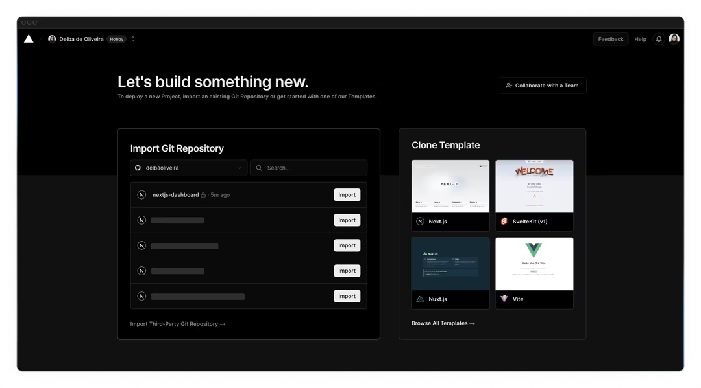
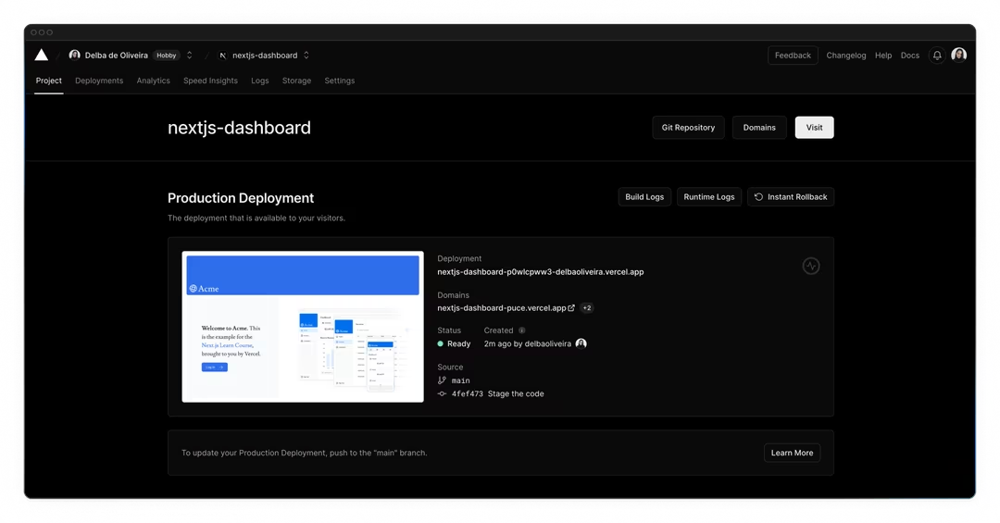
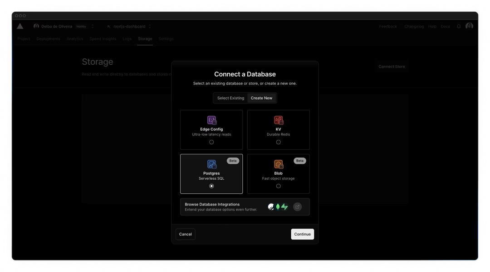
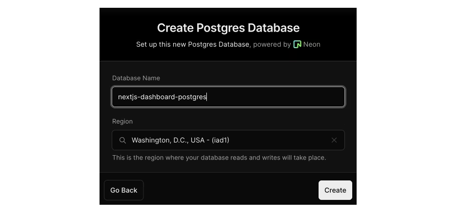
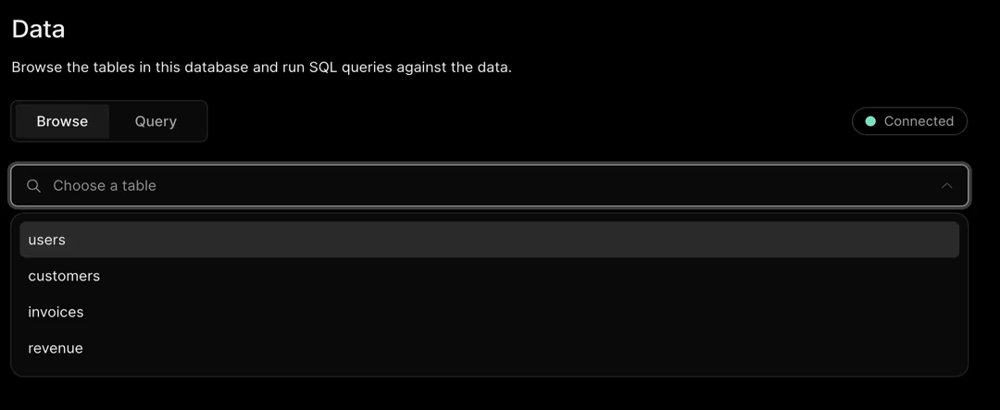

# Bab 6

## Setting Up Your Database
Sebelum Anda dapat melanjutkan bekerja pada dashboard Anda, Anda memerlukan beberapa data. Dalam bab ini, Anda akan menyiapkan database PostgreSQL menggunakan @vercel/postgres. Jika Anda sudah familiar dengan PostgreSQL dan lebih memilih untuk menggunakan penyedia Anda sendiri, Anda dapat melewati bab ini dan mengatur sendiri. Jika tidak, mari kita lanjutkan!

### Dalam bab ini...
Berikut adalah topik yang akan kita bahas:
- Mengunggah proyek Anda ke GitHub.
- Menyiapkan akun Vercel dan menghubungkan repo GitHub Anda untuk pratinjau instan dan penyebaran.
- Membuat dan menghubungkan proyek Anda ke database Postgres.
- Menyemai database dengan data awal.

### Membuat Repository GitHub
Untuk memulai, mari unggah repository Anda ke Github jika belum melakukannya. Ini akan mempermudah pengaturan database dan penyebaran.

Jika Anda memerlukan bantuan untuk mengatur repository, lihat panduan ini di GitHub.

Perlu diketahui:
- Anda juga dapat menggunakan penyedia Git lain seperti GitLab atau Bitbucket.
- Jika Anda baru mengenal GitHub, kami merekomendasikan Aplikasi GitHub Desktop untuk alur kerja pengembangan yang disederhanakan.

### Membuat Akun Vercel
Kunjungi vercel.com/signup untuk membuat akun. Pilih rencana "hobi" gratis. Pilih Continue with GitHub untuk menghubungkan akun GitHub dan Vercel Anda.

### Menghubungkan dan Menyebarkan Proyek Anda
Selanjutnya, Anda akan dibawa ke layar ini di mana Anda dapat memilih dan mengimpor repository GitHub yang baru saja Anda buat:

Nama proyek Anda dan klik Deploy.

Hore! 🎉 Proyek Anda sekarang disebarkan.

Dengan menghubungkan repository GitHub Anda, setiap kali Anda mendorong perubahan ke cabang utama, Vercel akan secara otomatis menyebarkan ulang aplikasi Anda tanpa konfigurasi yang diperlukan. Saat membuka pull request, Anda juga akan memiliki pratinjau instan yang memungkinkan Anda menangkap kesalahan penyebaran lebih awal dan berbagi pratinjau proyek Anda dengan anggota tim untuk umpan balik.

### Membuat Database Postgres
Selanjutnya, untuk mengatur database, klik Continue to Dashboard dan pilih tab Storage dari dashboard proyek Anda. Pilih Connect Store → Create New → Postgres → Continue.

Terima syaratnya, beri nama database Anda, dan pastikan wilayah database Anda diatur ke Washington D.C (iad1) - ini juga merupakan wilayah default untuk semua proyek Vercel baru. Dengan menempatkan database Anda di wilayah yang sama atau dekat dengan kode aplikasi Anda, Anda dapat mengurangi latensi untuk permintaan data.

Perlu diketahui: Anda tidak dapat mengubah wilayah database setelah diinisialisasi. Jika Anda ingin menggunakan wilayah yang berbeda, Anda harus mengaturnya sebelum membuat database.

Setelah terhubung, navigasikan ke tab .env.local, klik Show secret dan Copy Snippet. Pastikan Anda mengungkapkan rahasia sebelum menyalinnya.

Navigasikan ke editor kode Anda dan ganti nama file .env.example menjadi .env. Tempelkan isi yang disalin dari Vercel.

Penting: Pergi ke file .gitignore Anda dan pastikan .env ada dalam file yang diabaikan untuk mencegah rahasia database Anda terungkap saat Anda mendorong ke GitHub.

Terakhir, jalankan `pnpm i @vercel/postgres` di terminal Anda untuk menginstal Vercel Postgres SDK.

### Menyemai Database Anda
Sekarang database Anda telah dibuat, mari menyemai dengan beberapa data awal.

Di dalam /app, ada folder bernama seed. Uncomment file ini. Folder ini berisi Next.js Route Handler, yang disebut route.ts, yang akan digunakan untuk menyemai database Anda. Ini membuat endpoint sisi server yang dapat Anda akses di browser untuk mulai mengisi database Anda.

Jangan khawatir jika Anda tidak memahami semua yang dilakukan oleh kode ini, tetapi untuk memberi gambaran, skrip menggunakan SQL untuk membuat tabel, dan data dari file placeholder-data.ts untuk mengisinya setelah dibuat.

Pastikan server pengembangan lokal Anda berjalan dengan `pnpm run dev` dan navigasikan ke localhost:3000/seed di browser Anda. Setelah selesai, Anda akan melihat pesan "Database seeded successfully" di browser. Setelah selesai, Anda dapat menghapus file ini.

### Pemecahan Masalah:
- Pastikan untuk mengungkapkan rahasia database Anda sebelum menyalinnya ke file .env Anda.
- Skrip menggunakan bcrypt untuk meng-hash kata sandi pengguna, jika bcrypt tidak kompatibel dengan lingkungan Anda, Anda dapat memperbarui skrip untuk menggunakan bcryptjs sebagai gantinya.
- Jika Anda mengalami masalah saat menyemai database Anda dan ingin menjalankan skrip lagi, Anda dapat menghapus tabel yang ada dengan menjalankan DROP TABLE tablename di antarmuka kueri database Anda. Lihat bagian menjalankan kueri di bawah untuk detail lebih lanjut. Tapi hati-hati, perintah ini akan menghapus tabel dan semua datanya. Tidak apa-apa untuk melakukan ini dengan aplikasi contoh Anda karena Anda bekerja dengan data placeholder, tetapi Anda tidak boleh menjalankan perintah ini di aplikasi produksi.
- Jika Anda terus mengalami masalah saat menyemai database Vercel Postgres Anda, silakan buka diskusi di GitHub.

### Menjelajahi Database Anda
Mari kita lihat bagaimana tampilan database Anda. Kembali ke Vercel, dan klik Data di sidenav.

Di bagian ini, Anda akan menemukan empat tabel baru: users, customers, invoices, dan revenue.

Dengan memilih setiap tabel, Anda dapat melihat rekamannya dan memastikan entri sesuai dengan data dari file placeholder-data.ts.

### Menjalankan Kueri
Anda dapat beralih ke tab "query" untuk berinteraksi dengan database Anda. Bagian ini mendukung perintah SQL standar. Misalnya, memasukkan DROP TABLE customers akan menghapus tabel "customers" beserta semua datanya - jadi hati-hati!

Mari jalankan kueri database pertama Anda. Tempelkan dan jalankan kode SQL berikut ke antarmuka Vercel:

```sql
SELECT invoices.amount, customers.name
FROM invoices
JOIN customers ON invoices.customer_id = customers.id
WHERE invoices.amount = 666;
```
