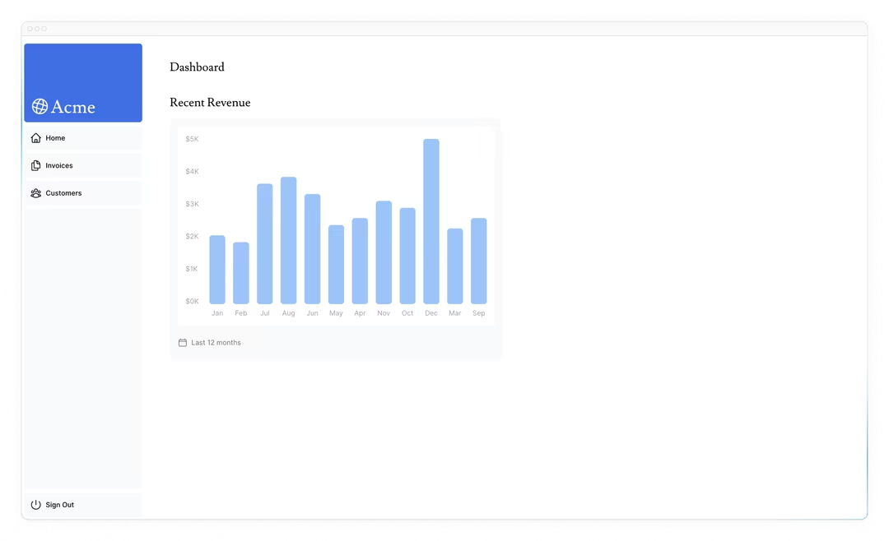
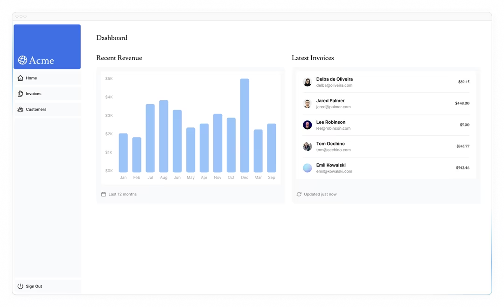
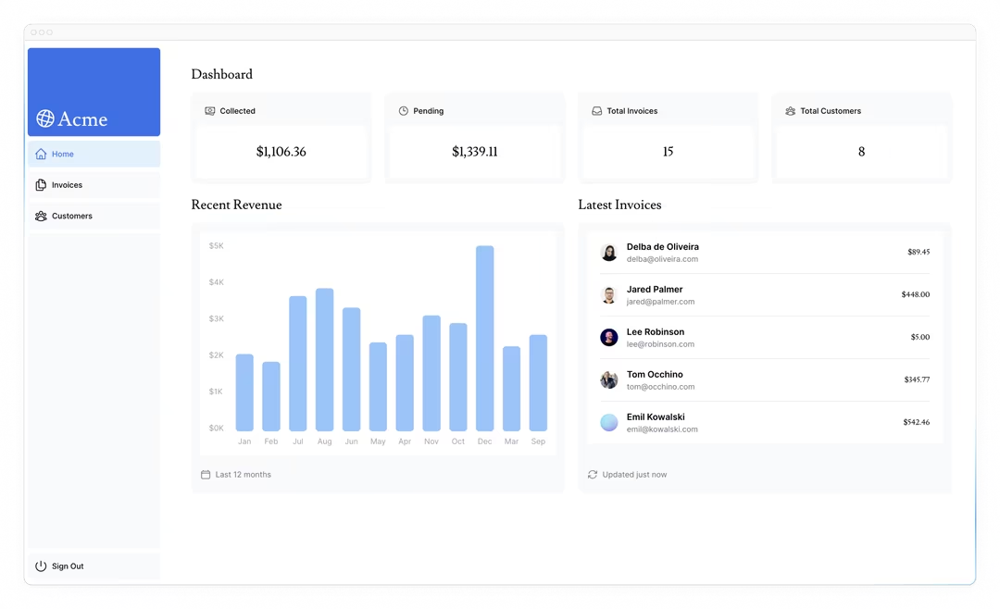

# Bab 7

## Fetching Data

Sekarang setelah Anda membuat dan menyemai database, mari kita bahas berbagai cara Anda dapat mengambil data untuk aplikasi Anda, dan membangun halaman ikhtisar dashboard Anda.

### Dalam bab ini...

Berikut adalah topik yang akan kita bahas:

- Memahami beberapa pendekatan untuk mengambil data: API, ORM, SQL, dll.
- Bagaimana Komponen Server dapat membantu Anda mengakses sumber daya back-end dengan lebih aman.
- Apa itu network waterfalls.
- Cara mengimplementasikan pengambilan data paralel menggunakan Pola JavaScript.

### Memilih Cara Mengambil Data

#### Lapisan API

API adalah lapisan perantara antara kode aplikasi Anda dan database. Ada beberapa kasus di mana Anda mungkin menggunakan API:

- Jika Anda menggunakan layanan pihak ketiga yang menyediakan API.
- Jika Anda mengambil data dari klien, Anda ingin memiliki lapisan API yang berjalan di server untuk menghindari mengekspos rahasia database Anda ke klien.

Di Next.js, Anda dapat membuat endpoint API menggunakan Route Handlers.

#### Kueri Database

Saat Anda membuat aplikasi full-stack, Anda juga perlu menulis logika untuk berinteraksi dengan database Anda. Untuk database relasional seperti Postgres, Anda dapat melakukannya dengan SQL atau dengan ORM.

Ada beberapa kasus di mana Anda harus menulis kueri database:

- Saat membuat endpoint API Anda, Anda perlu menulis logika untuk berinteraksi dengan database Anda.
- Jika Anda menggunakan Komponen Server React (mengambil data di server), Anda dapat melewati lapisan API, dan langsung mengkueri database Anda tanpa risiko mengekspos rahasia database Anda ke klien.

Mari kita pelajari lebih lanjut tentang Komponen Server React.

### Menggunakan Komponen Server untuk Mengambil Data

Secara default, aplikasi Next.js menggunakan Komponen Server React. Mengambil data dengan Komponen Server adalah pendekatan yang relatif baru dan ada beberapa manfaat menggunakan mereka:

- Komponen Server mendukung janji (promises), memberikan solusi yang lebih sederhana untuk tugas asinkron seperti pengambilan data. Anda dapat menggunakan sintaks async/await tanpa harus menggunakan useEffect, useState, atau pustaka pengambilan data.
- Komponen Server dieksekusi di server, sehingga Anda dapat menjaga pengambilan data dan logika yang mahal di server dan hanya mengirim hasilnya ke klien.
- Seperti yang disebutkan sebelumnya, karena Komponen Server dieksekusi di server, Anda dapat langsung mengkueri database tanpa lapisan API tambahan.

### Menggunakan SQL

Untuk proyek dashboard Anda, Anda akan menulis kueri database menggunakan Vercel Postgres SDK dan SQL. Ada beberapa alasan mengapa kita akan menggunakan SQL:

- SQL adalah standar industri untuk mengkueri database relasional (misalnya ORM menghasilkan SQL di bawah tenda).
- Memiliki pemahaman dasar tentang SQL dapat membantu Anda memahami dasar-dasar database relasional, memungkinkan Anda menerapkan pengetahuan Anda ke alat lain.
- SQL serbaguna, memungkinkan Anda mengambil dan memanipulasi data spesifik.
- Vercel Postgres SDK memberikan perlindungan terhadap injeksi SQL.

Jangan khawatir jika Anda belum pernah menggunakan SQL sebelumnya - kami telah menyediakan kuerinya untuk Anda.

Buka /app/lib/data.js, di sini Anda akan melihat bahwa kami mengimpor fungsi sql dari @vercel/postgres. Fungsi ini memungkinkan Anda mengkueri database Anda:

```javascript
// /app/lib/data.js
import { sql } from "@vercel/postgres";
// ...
```

Anda dapat memanggil sql di dalam Komponen Server mana pun. Tetapi untuk memungkinkan Anda menavigasi komponen dengan lebih mudah, kami menyimpan semua kueri data di file data.js, dan Anda dapat mengimpornya ke dalam komponen.

Catatan: Jika Anda menggunakan penyedia database Anda sendiri di Bab 6, Anda perlu memperbarui kueri database agar berfungsi dengan penyedia Anda. Anda dapat menemukan kueri di /app/lib/data.js.

### Mengambil Data untuk Halaman Ikhtisar Dashboard

Sekarang setelah Anda memahami berbagai cara mengambil data, mari kita mengambil data untuk halaman ikhtisar dashboard. Navigasikan ke /app/dashboard/page.jsx, tempelkan kode berikut, dan luangkan waktu untuk menjelajahinya:

```javascript
// /app/dashboard/page.jsx
import { Card } from "@/app/ui/dashboard/cards";
import RevenueChart from "@/app/ui/dashboard/revenue-chart";
import LatestInvoices from "@/app/ui/dashboard/latest-invoices";
import { lusitana } from "@/app/ui/fonts";

export default async function Page() {
  return (
    <main>
      <h1 className={`${lusitana.className} mb-4 text-xl md:text-2xl`}>
        Dashboard
      </h1>
      <div className="grid gap-6 sm:grid-cols-2 lg:grid-cols-4">
        {/* <Card title="Collected" value={totalPaidInvoices} type="collected" /> */}
        {/* <Card title="Pending" value={totalPendingInvoices} type="pending" /> */}
        {/* <Card title="Total Invoices" value={numberOfInvoices} type="invoices" /> */}
        {/* <Card title="Total Customers" value={numberOfCustomers} type="customers" /> */}
      </div>
      <div className="mt-6 grid grid-cols-1 gap-6 md:grid-cols-4 lg:grid-cols-8">
        {/* <RevenueChart revenue={revenue}  /> */}
        {/* <LatestInvoices latestInvoices={latestInvoices} /> */}
      </div>
    </main>
  );
}
```

Dalam kode di atas:

- `Page` adalah komponen async. Ini memungkinkan Anda menggunakan await untuk mengambil data.
- Ada juga 3 komponen yang menerima data: `<Card>`, `<RevenueChart>`, dan `<LatestInvoices>`. Mereka saat ini dikomentari untuk mencegah aplikasi mengalami kesalahan.

### Mengambil Data untuk `<RevenueChart/>`

Untuk mengambil data untuk komponen `<RevenueChart/>`, impor fungsi `fetchRevenue` dari data.js dan panggil di dalam komponen Anda:

```javascript
// /app/dashboard/page.jsx
import { Card } from "@/app/ui/dashboard/cards";
import RevenueChart from "@/app/ui/dashboard/revenue-chart";
import LatestInvoices from "@/app/ui/dashboard/latest-invoices";
import { lusitana } from "@/app/ui/fonts";
import { fetchRevenue } from "@/app/lib/data";

export default async function Page() {
  const revenue = await fetchRevenue();
  // ...
}
```

Kemudian, uncomment komponen `<RevenueChart/>`, navigasikan ke file komponen (/app/ui/dashboard/revenue-chart.jsx) dan uncomment kode di dalamnya. Periksa localhost Anda, Anda seharusnya dapat melihat grafik yang menggunakan data pendapatan.


### Mengambil Data untuk `<LatestInvoices/>`

Untuk komponen `<LatestInvoices />`, kita perlu mendapatkan 5 faktur terbaru, diurutkan berdasarkan tanggal.

Anda bisa mengambil semua faktur dan mengurutkannya menggunakan JavaScript. Ini tidak menjadi masalah karena data kita kecil, tetapi seiring pertumbuhan aplikasi Anda, ini dapat secara signifikan meningkatkan jumlah data yang ditransfer pada setiap permintaan dan JavaScript yang diperlukan untuk mengurutkannya.

Alih-alih mengurutkan faktur terbaru di memori, Anda dapat menggunakan kueri SQL untuk mengambil hanya 5 faktur terakhir. Misalnya, ini adalah kueri SQL dari file data.js Anda:

```javascript
// /app/lib/data.js
// Fetch the last 5 invoices, sorted by date
const data =
  (await sql) <
  LatestInvoiceRaw >
  `
  SELECT invoices.amount, customers.name, customers.image_url, customers.email
  FROM invoices
  JOIN customers ON invoices.customer_id = customers.id
  ORDER BY invoices.date DESC
  LIMIT 5`;
```

Di halaman Anda, impor fungsi `fetchLatestInvoices`:

```javascript
// /app/dashboard/page.jsx
import { Card } from "@/app/ui/dashboard/cards";
import RevenueChart from "@/app/ui/dashboard/revenue-chart";
import LatestInvoices from "@/app/ui/dashboard/latest-invoices";
import { lusitana } from "@/app/ui/fonts";
import { fetchRevenue, fetchLatestInvoices } from "@/app/lib/data";

export default async function Page() {
  const revenue = await fetchRevenue();
  const latestInvoices = await fetchLatestInvoices();
  // ...
}
```

Kemudian, uncomment komponen `<LatestInvoices />`. Anda juga perlu uncomment kode yang relevan di dalam komponen `<LatestInvoices />` itu sendiri, yang terletak di /app/ui/dashboard/latest-invoices.

Jika Anda mengunjungi localhost Anda, Anda seharusnya melihat bahwa hanya 5 faktur terakhir yang dikembalikan dari database. Semoga, Anda mulai melihat keuntungan dari mengkueri database Anda secara langsung!


### Latihan: Mengambil Data untuk Komponen `<Card>`

Sekarang giliran Anda untuk mengambil data untuk komponen `<Card>`. Kartu-kartu akan menampilkan data berikut:

- Total jumlah faktur yang dikumpulkan.
- Total jumlah faktur yang tertunda.
- Total jumlah faktur.
- Total jumlah pelanggan.

Sekali lagi, Anda mungkin tergoda untuk mengambil semua faktur dan pelanggan, dan menggunakan JavaScript untuk memanipulasi data. Misalnya, Anda dapat menggunakan Array.length untuk mendapatkan jumlah total faktur dan pelanggan:

```javascript
const totalInvoices = allInvoices.length;
const totalCustomers = allCustomers.length;
```

Tetapi dengan SQL, Anda dapat mengambil hanya data yang Anda butuhkan. Ini sedikit lebih panjang daripada menggunakan Array.length, tetapi berarti lebih sedikit data yang perlu ditransfer selama permintaan. Ini adalah alternatif SQL:

```javascript
// /app/lib/data.js
const invoiceCountPromise = sql`SELECT COUNT(*) FROM invoices`;
const customerCountPromise = sql`SELECT COUNT(*) FROM customers`;
```

Fungsi yang perlu Anda impor disebut `fetchCardData`. Anda perlu mendestructur nilai yang dikembalikan dari fungsi tersebut.

Petunjuk:

- Periksa komponen kartu untuk melihat data apa yang mereka butuhkan.
- Periksa file data.js untuk melihat apa yang dikembalikan oleh fungsi tersebut.

Setelah Anda siap, perluas toggle di bawah untuk kode akhirnya:

Bagus! Anda sekarang telah mengambil semua data untuk halaman ikhtisar dashboard. Halaman Anda harus terlihat seperti ini:

Namun... ada dua hal yang perlu Anda sadari:

1. Permintaan data secara tidak sengaja saling memblokir, menciptakan waterfall permintaan.
2. Secara default, Next.js melakukan prerendring rute untuk meningkatkan kinerja, ini disebut Rendering Statis. Jadi jika data Anda berubah, itu tidak akan tercermin di dashboard Anda.

Mari kita bahas nomor 1 dalam bab ini, lalu lihat lebih detail pada nomor 2 di bab berikutnya.

### Apa itu Request Waterfalls?

"Waterfall" mengacu pada serangkaian permintaan jaringan yang bergantung pada penyelesaian permintaan sebelumnya. Dalam hal pengambilan data, setiap permintaan hanya dapat dimulai setelah permintaan sebelumnya mengembalikan data.

Misalnya, kita perlu menunggu `fetchRevenue()` dieksekusi sebelum `fetchLatestInvoices()` dapat mulai berjalan, dan seterusnya.

```javascript
// /app/dashboard/page.jsx
const revenue = await fetchRevenue();
const latestInvoices = await fetchLatestInvoices(); // tunggu fetchRevenue() selesai
const {
  numberOfInvoices,
  numberOfCustomers,
  totalPaidInvoices,
  totalPendingInvoices,
} = await fetchCardData(); // tunggu fetchLatestInvoices() selesai
```

Pola ini tidak selalu buruk. Mungkin ada kasus di mana Anda menginginkan waterfall karena Anda ingin suatu kondisi dipenuhi sebelum Anda membuat permintaan berikutnya. Misalnya, Anda mungkin ingin mengambil ID pengguna dan informasi profil mereka terlebih dahulu. Setelah Anda memiliki ID, Anda mungkin kemudian mengambil daftar teman mereka. Dalam hal ini, setiap permintaan bergantung pada data yang dikembalikan dari permintaan sebelumnya.

Namun, perilaku ini juga bisa tidak disengaja dan memengaruhi kinerja.

### Pengambilan Data Paralel

Cara umum untuk menghindari waterfall adalah memulai semua permintaan data pada saat yang sama - secara paralel.

Di JavaScript, Anda dapat menggunakan fungsi `Promise.all()` atau `Promise.allSettled()` untuk memulai semua janji pada saat yang sama. Misalnya, di data.js, kita menggunakan `Promise.all()` dalam fungsi `fetchCardData()`:

```javascript
// /app/lib/data.js
export async function fetchCardData() {
  try {
    const invoiceCountPromise = sql`SELECT COUNT(*) FROM invoices`;
    const customerCountPromise = sql`SELECT COUNT(*) FROM customers`;
    const invoiceStatusPromise = sql`SELECT
         SUM(CASE WHEN status = 'paid' THEN amount ELSE 0 END) AS "paid",
         SUM(CASE WHEN status = 'pending' THEN amount ELSE 0 END) AS "pending"
         FROM invoices`;

    const data = await Promise.all([
      invoiceCountPromise,
      customerCountPromise,
      invoiceStatusPromise,
    ]);
    // ...
  }
}
```

Dengan menggunakan pola ini, Anda dapat:

- Mulai mengeksekusi semua pengambilan data pada saat yang sama, yang dapat menyebabkan peningkatan kinerja.
- Menggunakan pola JavaScript asli yang dapat diterapkan ke pustaka atau kerangka kerja apa pun.

Namun, ada satu kelemahan mengandalkan hanya pada pola JavaScript ini: apa yang terjadi jika satu permintaan data lebih lambat dari semua yang lain?
